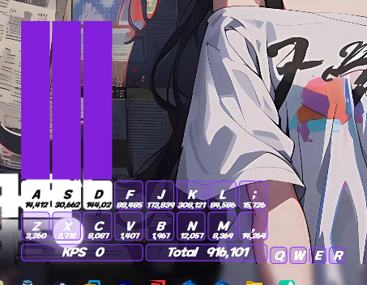
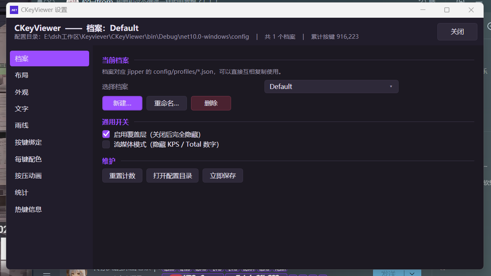
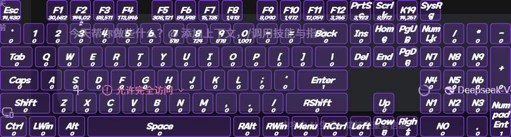
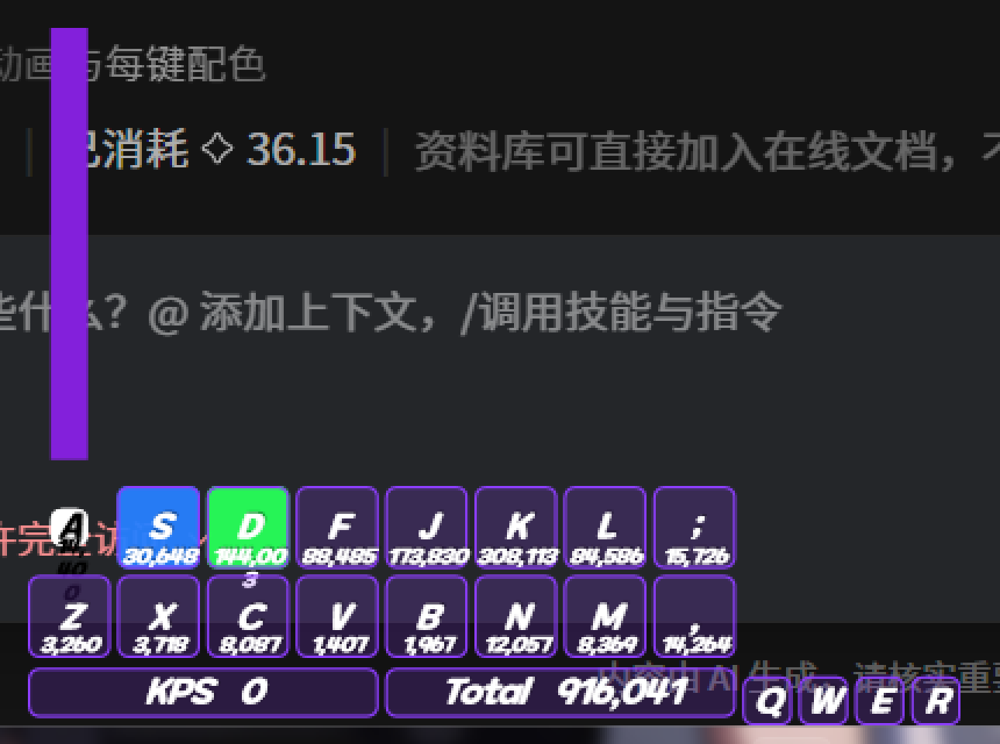
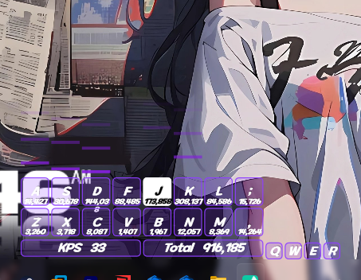
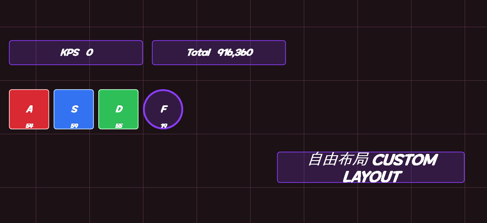
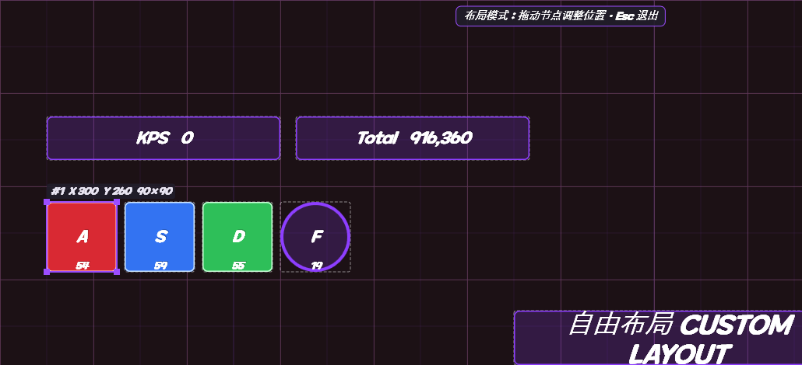
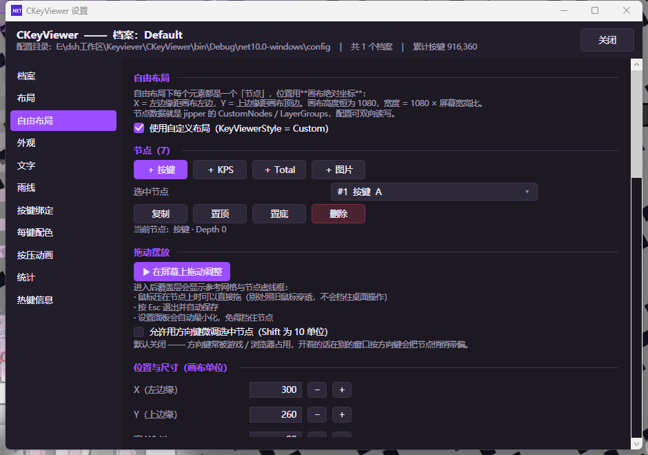
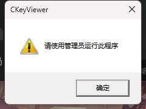
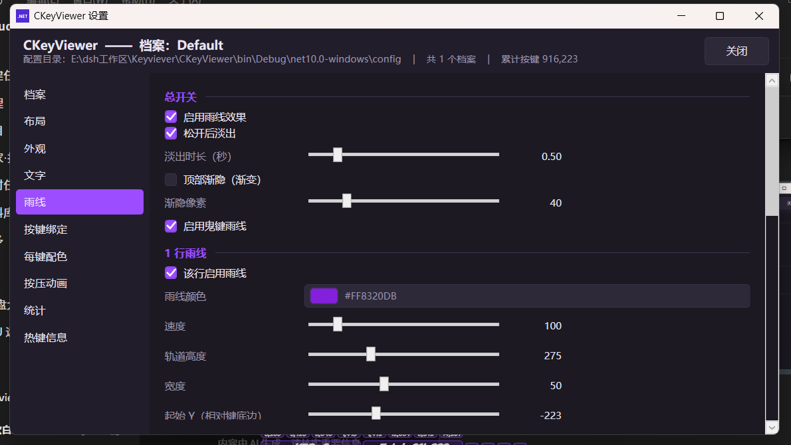

# CKeyViewer

Windows 上的**按键可视化覆盖层**（KeyViewer）—— 透明置顶窗口，实时显示每个按键的按下状态、按键计数、KPS 与「雨线」特效。

配置格式与 [JipperKeyViewer](https://github.com/adofaiex/JipperKeyViewer)（作者 HitMargin，下称 jipper）**双向兼容**：原版的 `config` 目录可以直接拷过来用，改完也能拿回去。



> 按住 A / S / D：键帽高亮为白底、雨线从键帽上方升起，每个键下方是累计点击次数，底部是 KPS 与 Total。

---

## 特性

| 分类 | 内容 |
| --- | --- |
| **窗口** | 无边框透明置顶窗口，鼠标完全穿透、不抢焦点、不出现在任务栏/Alt+Tab |
| **权限** | 启动时检查管理员权限，非管理员弹窗提示后退出（读不到管理员进程的按键） |
| **键盘样式** | 主键 8 种（Key8 / 10 / 12 / 14 / 16 / 20 / 24 / 108 全键盘）+ 脚键 8 种（2 ~ 16 键） |
| **可绑按键** | 任意字母 / 数字 / 功能键 / 小键盘 / **左右区分的 Shift / Ctrl / Alt** / **鼠标左右中侧键** |
| **配色** | 全局配色（常态 / 按下）+ 42 个槽位的**每键配色** + Full108 统一配色，均含背景 / 描边 / 文字 |
| **文字** | 字号、字体（含 jipper 的 OTF 支持）、描边、阴影、计数格式化、隐藏主键计数、流媒体模式 |
| **雨线** | 三行独立的速度 / 高度 / 宽度 / 起始 Y，渐变色与淡出，描边与阴影；**鬼键雨线**（独立配色）；可分别开关每行 |
| **按压缩放** | 按下缩到指定倍数、松开弹回；27 条缓动曲线；可选雨线跟随缩放 |
| **统计** | KPS 实时速率、Total 累计总数、每键计数；支持居中 / 堆叠 / 独立位置 |
| **自由布局** | 每个元素是一个可拖拽的「节点」，位置 / 尺寸 / 层级 / 配色 / 按键绑定全可调，支持图层组与图片节点；**在覆盖层上直接拖动摆放** |
| **档案** | 多档案热切换，与 jipper 的 `profiles/*.json` 一一对应 |
| **界面** | 深色设置面板（11 个标签页），改动即时生效 + 防抖落盘；系统托盘；5 组全局热键（带备选） |









---

## 环境要求

- **运行**：Windows 10 / 11 x64。发布的单文件版本自带 .NET 运行时，**无需安装任何依赖**。
- **权限**：**必须以管理员身份运行**，否则会弹出提示并直接退出（见下）。
- **构建**：.NET SDK 10.0 及以上。

---

## 必须管理员运行



程序启动时会先检查自己是否以管理员身份（高完整性级别）运行。**不是就直接弹这个提示，然后结束进程**。

原因：按键状态走 `GetAsyncKeyState`，当**更高完整性级别**的程序在前台时
（典型情况：以管理员身份启动的游戏），低完整性级别的进程读不到它的按键 ——
表现就是覆盖层完全没反应。所以本程序的权限必须**不低于**你要观察的那个程序。

实现上是**运行时主动检查**，没有在清单里写 `requestedExecutionLevel = requireAdministrator`：

| | 清单方式 | 本程序的做法 |
| --- | --- | --- |
| 提示 | Windows 自己的 UAC 对话框 | 自定义弹窗，文案可说明原因 |
| 被拒绝时 | 系统直接结束进程，用户一头雾水 | 先告诉用户「该怎么办」再退出 |
| 弹窗层级 | 无 | `MB_TOPMOST` —— 覆盖层是全屏置顶窗口，普通弹窗会被它压住看不见 |

以管理员身份启动：右键 `CKeyViewer.exe` → **以管理员身份运行**；
或者右键 → 属性 → 兼容性 → 勾选「以管理员身份运行此程序」，之后双击即可。

---

## 快速开始

### 直接使用发布版

```bash
dist/CKeyViewer.exe
```

> **要以管理员身份运行**：右键 → 以管理员身份运行。双击会弹出「请使用管理员运行此程序」然后退出。
> 首次启动需要解包自带运行时，会有几秒延迟。日志写在 exe 同级的 `ckv_error.log`。
> 如果双击后毫无反应，把 `CKeyViewer.exe` 连同生成的 `config/` 拷到一个普通目录
> （例如 `C:\CKeyViewer\`）再运行 —— 部分受管控目录会阻止单文件程序映射自身。

首次启动时，如果 exe 所在目录的附近（exe 目录、若干级祖先目录、当前工作目录）能找到 jipper 的 `config`，
会自动迁移一份到 `config/`，原有的按键计数与配色开箱即用。

### 从源码构建

```bash
cd CKeyViewer

# 开发构建
dotnet build -c Debug
bin/Debug/net10.0-windows/CKeyViewer.exe

# 自包含单文件发布
dotnet publish -c Release -r win-x64 --self-contained true \
  -p:PublishSingleFile=true -p:IncludeNativeLibrariesForSelfExtract=true \
  -p:DebugType=none -o ../dist
```

---

## 操作方式

### 全局热键

字母组合容易和别的软件撞车（例如 `Ctrl+Alt+P` 在不少机器上已被占用），
所以每组动作都带**备选键**，撞车时自动退档；实际生效的组合可以在设置面板的「热键信息」页查看。

| 动作 | 主选 | 备选 |
| --- | --- | --- |
| 显示 / 隐藏覆盖层 | `Ctrl+Alt+K` | `F9` |
| 计数归零 | `Ctrl+Alt+R` | `F10` |
| 切换到下一个档案 | `Ctrl+Alt+N` | `Ctrl+Alt+P` → `F11` |
| 打开设置面板 | `Ctrl+Alt+S` | `F12` |
| 进入 / 退出自由布局拖动模式 | `Ctrl+Alt+L` | `Ctrl+Alt+F8` |

> 热键注册在覆盖层窗口上。该窗口虽然鼠标穿透且不抢焦点，但依然有消息队列，能正常接收 `WM_HOTKEY`。

### 绑定按键



在「按键绑定」页或「自由布局」页的节点里点一下绑定按钮，它变成「请按键…」，然后按下你想绑的键即可。

- **支持修饰键**：可以单独绑 `Shift` / `Ctrl` / `Alt`，而且是**左右分开**的
  （原版 Unity KeyCode 就是 `LeftShift` / `RightShift` 两个值）。
- **支持鼠标键**：左键 → `Mouse0`、右键 → `Mouse1`、中键 → `Mouse2`、两个侧键 → `Mouse3` / `Mouse4`。
- **按 `Esc` 取消**（因此 `Esc` 本身不可绑定）。
- 捕获走 `GetAsyncKeyState` 轮询而不是窗口的键盘事件 —— 修饰键在 WPF 里会被当成组合前缀，
  鼠标键更是压根不产生键盘事件；轮询则键盘鼠标一视同仁。详见
  [已知限制](#已知限制) 与源码里 `Kit.KeyCapture` 的注释。
- 想让绑定的键**不落到别的程序里**（例如一边开游戏一边绑），先让设置面板保持焦点再按；
  如果不介意，直接按也行 —— 捕获不依赖窗口焦点。

### 自检

```bash
CKeyViewer.exe --selftest            # 结果写到 exe 同级的 ckv_selftest.txt
CKeyViewer.exe --selftest D:\out.txt
```

跑一遍无界面的逻辑自检（键盘修饰键 / 鼠标键 / 边界情况），用来确认按键捕获没被改坏。

### 系统托盘

托盘图标读程序集里嵌入的 `app.ico`（9 档尺寸，由 `icon/icon.png` 生成），右键菜单：
显示/隐藏、重置计数、切换档案、**自由布局**、设置、打开配置目录、退出。
双击图标等同「显示 / 隐藏」。

> Windows 11 默认把新注册的托盘图标收进「隐藏的图标」折叠区，需要点托盘左侧的 `^` 才能看到。
> 第一次运行后，把它从折叠区拖到任务栏上常驻即可。

### 设置面板

11 个标签页：**档案 / 布局 / 自由布局 / 外观 / 文字 / 雨线 / 按键绑定 / 每键配色 / 按压动画 / 统计 / 热键信息**。
所有改动即时生效，600 ms 防抖后写入磁盘；面板会记住上次停留的标签页。

---

## 自由布局（Custom Layout）

预设布局（Key8 / Key16 / Full108 …）只能整体缩放和摆放，想「把 A 放到左上角、KPS 条放到中间」
就得用自由布局。它在配置里对应 jipper 的 `CustomNodes` / `LayerGroups` 两组字段，**双向兼容**。


### 画布坐标

内部画布**高度恒为 1080**，宽度 = `1080 × 屏幕宽高比`：

```
CanvasWidth = 1080 * ScreenWidth / ScreenHeight
```

节点的 `X` / `Y` 是**画布绝对坐标**（不是归一化值）：

- `X` —— 节点**左边缘**距画布左边的距离；
- `Y` —— 节点**上边缘**距画布**顶边**的距离（注意是「距顶部」，不是距底部）。

渲染时还会乘上全局 `Size` 缩放系数：

```
屏幕物理 x = X * (屏幕物理高 / 1080) * Size
屏幕物理 y = Y * (屏幕物理高 / 1080) * Size
```

所以画布上 `Y` 越大，节点越靠下。填 `(300, 260, 90, 90)` 就是左上偏中位置的一个 90×90 键帽。

### 节点类型

| `NodeType` | 含义 | 典型尺寸 |
| --- | --- | --- |
| `0` | 普通按键（绑定一个 `KeyBind`） | 90 × 90 |
| `1` | KPS 统计条 | 300 × 56 |
| `2` | Total 累计统计条 | 300 × 56 |
| `3` | 图片 / 视频（`ImagePath` / `VideoPath`） | 自定义 |

`KeyBind` 存的是 Unity `KeyCode` 的**枚举成员名**（`"A"` / `"Space"` / `"LeftShift"`），
不是键帽上的显示字；显示字由 `CustomText` 单独指定。

每个节点有自己的 `Count`（点击次数）与 `CountInTotal`（是否累加进 Total），
所以自由布局下的每键计数与预设布局是**两套独立存储**。

### 节点配色

`Colors` 是长度**恰好为 4** 的 `float[]`，即 `[r, g, b, a]`（各 0 ~ 1），需要 `UseCustomColor = true` 才生效。
长度不为 4 时会整组回落到全局配色 —— 这是原版的行为，本程序保持一致。

### 图层组

`LayerGroups` 里的每组是 `{ Id, Name, Visible }`，`Id` 形如 `"g1"` `"g2"`。
节点的 `GroupId` 指向所属组；节点可见 = 自身没勾 `Hidden` **且** 所属组 `Visible`。
把一组整体隐藏 / 显示，比逐个节点去点 `Hidden` 方便得多。

### 在屏幕上拖动摆放


按 `Ctrl+Alt+L`（占用时自动退到 `Ctrl+Alt+F8`）或点托盘菜单的「自由布局：拖动调整位置」进入**布局模式**：

- 覆盖层叠加一层**参考网格**（每 60 单位一条淡线、每 540 单位一条亮线），每个节点外面套一圈虚线框；
- **鼠标压在节点上时**才临时关掉鼠标穿透 —— 别处照旧穿透，不会挡住桌面操作；
- 拖动即改 `X` / `Y`，松开自动落盘；选中节点上方会浮出 `#1  X 300  Y 260  90×90` 的坐标小标签；
- 顶部提示条显示当前状态，按 **`Esc` 退出**并保存；
- 从设置面板点「▶ 在屏幕上拖动调整」进入时，**设置面板会自动最小化**，退出时还原。

> 方向键微调（1 单位，按住 `Shift` 为 10 单位）默认**关闭** —— 方向键常被游戏 / 浏览器占用，
> 一路按下去会把节点悄悄带偏。需要时在「自由布局」页勾选「允许用方向键微调选中节点」。

### 编辑器


「自由布局」标签页里可以：开关自定义布局、从当前预设一键生成节点（Full108 除外）、
增删 / 复制 / 置顶 / 置底节点、用**精确数值**调 X / Y / 宽 / 高 / 层级、
改按键绑定与按下文本、节点级配色与圆角 / 边框 / 透明度、节点雨线行号、
图片视频路径、图层组增删与归属，以及批量归零 / 显示 / 清空。

---

## 与 jipper 的配置兼容性

目录结构与 jipper 完全一致：

```
<exe 同级>/config/settings.json           # 全局设置（当前档案、档案列表、界面状态）
<exe 同级>/config/profiles/<档案名>.json   # 单个档案，202 项配置
```

因此：

- 把 jipper 的 `jipper/config` 整个覆盖到 `config/` 即可继承原有配置；
- 把 `config/` 拷回 jipper 同样可用（未识别的字段会被忽略而不是报错）。

坐标语义沿用原版：内部画布高度**恒为 1080**，宽度按屏幕宽高比推算
（`CanvasWidth = Screen.width * 1080 / Screen.height`）；
`MainKeyViewerPosition` / `FootKeyViewerPosition` 是 0 ~ 1 的归一化坐标，
`Size` 是整体缩放系数。

注意区分两套**互相独立**的机制：

- `KeyViewerStyle == Custom`（枚举值 `8`）—— 键位完全来自 `CustomNodes` 的**绝对画布坐标**；
- `MainKeyViewerPosition` 之类的归一化定位 —— 只作用于**预设布局**的自由摆放。

两者可以同时存在，但渲染时只有其中一个生效。

### 运行机制

- 按键状态通过 `GetAsyncKeyState` 以 **8 ms** 周期轮询，不使用键盘钩子，
  因此不会拖慢前台程序，也不受输入法 / 游戏独占模式影响。
- 布局模式额外跑一个 **16 ms** 的定时器轮询鼠标与 `Esc` / 方向键，
  鼠标压到节点上时才临时关掉 `WS_EX_TRANSPARENT`，其余时间照旧完全穿透。
- 每帧只在「有雨线 / KPS 有活动 / 按下状态变化 / 正在做按压缩放」时才重绘，
  完全静止时降到 **0.5 s** 一帧，待机几乎不占 CPU。
- 磁盘写入有 **600 ms** 防抖，另有 5 s 定时兜底落盘。

---

## 项目结构

```
CKeyViewer/
├─ Program.cs              装配：窗口 + 托盘 + 热键 + 设置面板（`--selftest` 无界面自检入口）
├─ Admin.cs                管理员权限检查 + 非管理员弹窗后退出
├─ SelfTest.cs             按键捕获的逻辑自检（假按键状态，不碰真实键鼠）
├─ OverlayWindow.cs        透明置顶 + 鼠标穿透 + Win32 扩展样式
├─ KvHost.cs               主循环：输入捕获、按键状态、统计、雨线驱动、防抖落盘、布局模式拖动
├─ KvTray.cs               托盘图标与菜单（读嵌入资源 CKeyViewer.app.ico）
├─ KvHotkeys.cs            全局热键（主选 + 备选）
├─ KvSettingsWindow.cs     深色设置面板（11 个标签页，含自由布局编辑器）
├─ Core/
│  ├─ KvGeometry.cs        8 种主键 + 8 种脚键的布局几何表
│  ├─ KvProfile.cs         202 项配置模型 + 自由布局辅助（节点增删 / 图层组 / 排序过滤）
│  ├─ KvFmNode.cs          自由布局节点（105 项字段，对齐原版 FmNode）
│  ├─ KvFmLayerGroup.cs    图层组
│  ├─ KvProfileStore.cs    配置读写 + jipper 自动迁移
│  ├─ KeyCodeMap.cs        Unity KeyCode ↔ 显示名 ↔ Win32 VK
│  ├─ KvEasing.cs          27 条缓动曲线（逐条对齐原版）
│  ├─ KeyStyle.cs / KeyRuntime.cs / RainDrop.cs / KvColor.cs
├─ Render/
│  ├─ OverlayRenderer.cs   即时模式绘制：键帽 + 文字 + 计数 + 布局模式装饰层
│  ├─ KvRainLayer.cs       雨线与鬼键雨线
│  ├─ KvTheme.cs / KvFonts.cs
├─ Ui/                     KvUiKit（控件工厂 + 深色模板 + KeyCapture 按键捕获）、取色器
├─ Native/Win32.cs         P/Invoke
├─ icon/icon.png           图标源图（1254×1254）
└─ assets/app.ico          应用图标（tools/makeicon.py 从 icon.png 生成 9 档）
```

---

## 开发辅助脚本

`tools/` 下是逆向、验证与截图用的一次性工具，纯 ctypes / 标准库，无第三方依赖：

| 脚本 | 用途 |
| --- | --- |
| `makeicon.py` | 用 Pillow 从 `CKeyViewer/icon/icon.png` 生成 9 档多尺寸 `app.ico`（含 256 px，分级降采样） |
| `deadcode.py` | 粗粒度死代码扫描：找出只被声明、从没被引用的类型与成员 |
| `runapp.py` | 启动调试版 → 等待 → 截图 → 读日志 → 结束（必须在同一进程里完成，后台会被回收） |
| `pecheck.py` | 解析 PE 资源目录，确认图标与版本信息真的嵌进了 exe |
| `gen_fmnode.py` | 从反射导出反推 `KvFmNode.cs` 的 105 项字段与默认值 |
| `screenshot.py` | 抓桌面截图（含分层窗口），可按矩形裁剪、整数倍放大 |
| `crop.py` | 纯标准库裁剪 / 放大 PNG（不依赖 Pillow） |
| `backdrop.py` | 自绘深色渐变背景窗口并定时顶到最前，让截图背景可复现 |
| `docshot.py` / `docshot2.py` | 出文档截图：启动 → 铺背景 → 造按键活动 → 按窗口矩形裁剪 |
| `press.py` / `tap.py` | 按住某键 N 秒 / 快速连打若干键（验证按下状态与 KPS） |
| `sendinput.py` | SendInput 精确注入：**左右区分的修饰键**与**鼠标左右中侧键**，另有 `probe` 列出当前按下的 VK |
| `keyup.py` | 强制释放按键 —— `press.py` 被强杀时异步键状态会永久卡在「按下」 |
| `drag.py` / `scroll.py` | 模拟鼠标拖动 / 滚轮（验证覆盖层拖动与设置面板滚动） |
| `sendchord.py` / `click.py` | 发送组合键 / 屏幕坐标点击（自动化 UI） |
| `settingsshot.py` | 指定标签页启动设置面板，按日志里的窗口矩形精确裁剪 |
| `migrate_config.py` | 把一个安装目录的 `config/` 迁移到另一个（迁移前务必先关掉目标目录里的程序） |
| `admintest.py` | 验证「非管理员 → 弹窗 + 终止进程」；只枚举窗口与截屏，**不发送任何键鼠输入** |
| `customuitest.py` | 「自由布局」设置页交互回归（滚动 + 点击 + 异常扫描） |
| `layouttest.py` | 布局模式端到端验证：进模式 → 拖动 → Esc → 校验落盘坐标 |
| `showdesktop.py` / `minimizeall.py` | 显示桌面 / 最小化全部窗口 |
| `unlock.py` / `wake.py` | 截图前唤醒显示器、退锁屏，避免抓到黑屏 |
| `runshot.sh` / `runhold.sh` | 上面几步的 shell 组合 |

> 注意：截屏类脚本必须在**同一次**命令里完成「启动 → 等待 → 截图 → 退出」，
> 否则子进程会随命令结束被回收。
>
> 覆盖层是**分层窗口 + `WS_EX_NOACTIVATE`**，WPF 的鼠标 / 键盘事件投递不可靠，
> 因此布局模式的交互一律走 `GetAsyncKeyState` 轮询 —— 调试这类问题时别指望控件事件。
>
> 想验证按键捕获**别用 `sendinput.py` 去点设置面板**：模拟键鼠会抢走用户当前的输入。
> 用 `CKeyViewer.exe --selftest`，它直接喂假的 VK 给纯函数，不碰真实键鼠。

---

## 已知限制

- 只在 Windows x64 上验证过；高 DPI 依赖 `PerMonitorV2`，跨屏移动时的重新布局未做实测。
- 必须以管理员身份运行（见 [必须管理员运行](#必须管理员运行)）—— 这是设计如此，不是缺陷。
  想观察以管理员启动的游戏，本程序的权限不能低于它。
- 自由布局的**图片 / 视频节点**（`NodeType = 3`）代码路径已就绪，但尚未做真机贴图回归。
- 鬼键雨线的代码路径已就绪，但默认配置里 `GhostKey*` 全为 0，需要先在「按键绑定」页绑定鬼键才能看到效果。

---

## 迁移已有配置

换目录（例如 `dist/` → `dist_new/`）时，把旧目录的 `config/` 搬过去就行：

```bash
python tools/migrate_config.py <源目录> <目标目录>
```

搬的是整个 `config/`（档案 + 全局设置），目标里同名文件会先备份成 `*.before-migrate`。
**迁移前务必先关掉目标目录里正在运行的程序**，否则它下一次落盘会把刚写进去的档案盖回去。
脚本不会改动源目录，所以搬错了重来即可。

---

## 声明

- 本项目是一个**独立实现**，不是 [JipperKeyViewer](https://github.com/adofaiex/JipperKeyViewer) 的官方版本，
  与原版作者 **HitMargin** 无隶属关系。
- 之所以叫「兼容」：为了让已有用户的 `config/`（按键计数、配色、自由布局）能继续用，
  本项目的配置模型与数据格式刻意对齐了原版 —— 这是**为互操作性**做的格式兼容，
  仓库内**不包含**原版的任何二进制、反编译代码或美术资源。
- `jipper/`（原版 DLL）、`re/`（反编译产物）等参考素材都写在 `.gitignore` 里，**不会**进入本仓库。
- 原版是 MelonLoader / UnityModManager 的**游戏内 Mod**；本程序是**独立进程**，
  通过 `GetAsyncKeyState` 轮询读取按键，两者实现方式完全不同。

## 许可

[MIT](LICENSE) © 2026 DXBbyd

> 用到了 [JipperKeyViewer](https://github.com/adofaiex/JipperKeyViewer) 的配置格式与行为约定，特此致谢。
> 若原版作者对格式兼容有异议，请开 issue，我会配合调整。
